# DocHelper + AITranslator（文案助手+AI翻译）

## 需求
- 广告素材文案撰写：用户提供产品特点关键词，生成指定平台（如Tiktok、小红书等）风格的广告文案，支持多语言
- 运营活动文案编写: 用户提供产品特点、活动背景关键词，生成活动文案，支持多语言
- App内文案翻译：产品经理提供英文文案excel，自动按数据平台格式生成指定的其它语言的文案（考虑格式、bmstyle、文案风格等问题）
---
## 实现方案
- ChatGPT + AirCode + 飞书机器人 + Jenkins

---
## 交互形式
- 输入：飞书机器人、Jenkins网页上传Excel
- 输出：飞书机器人
---
## DocHelper命令说明
- /help         显示所有命令
- /clear        清除对话上下文
- /red          小红书文案撰写（知识传递、生活化、感性表达、形象化、多元化、社交化）
- /tiktok       抖音（TikTok）文案撰写（紧凑易懂、夸张幽默、沉浸式、社交化、引导行为、多语言）
- /amazon       亚马逊商品详情页文案（简洁明了、重点突出、语言生动、细节丰富、评价引导）
- /marketing    运营活动文案撰写（需要提供活动风格、产品特点、活动背景等关键词）
- /translate    文本翻译（文本长度小于20个中文，翻译结果一起输出简体中文、英语、土耳其语、德语、日语、法语、意大利语、俄语、印度语、葡萄牙语、荷兰语、繁体中文、韩语）
---
## AITranslator功能说明
### 功能
- 解析Excel
- 按行自动识别源语言
- 行数无限制
- 输出所有支持的语言（中英德日法意葡繁）

### 操作流程
- 加入翻译结果通知群
- 打开新建翻译任务的网页：http://192.168.8.9/job/AITranslator/build?delay=0sec
- 上传.xlsx/.csv格式文件至Jenkins任务中（文件名中不可包含空格）
- 点击Build
- 等待飞书机器人发送通知到通知群
---
## 操作示范
### DocHelper
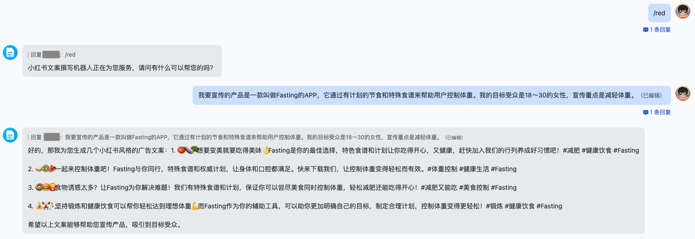

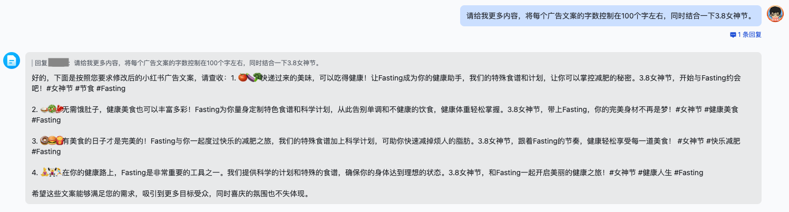

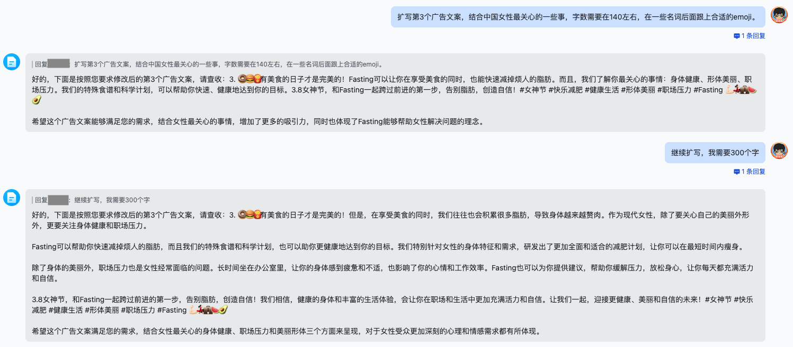

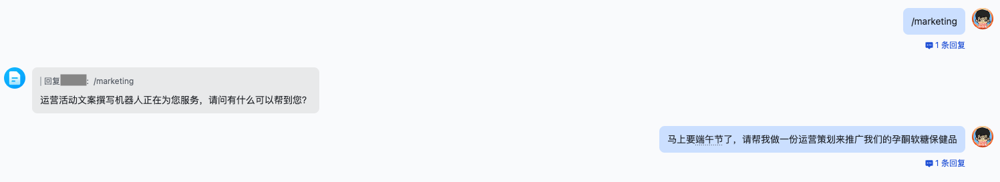

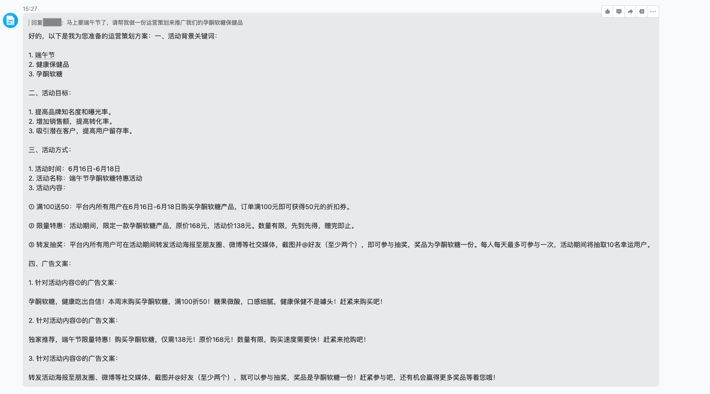

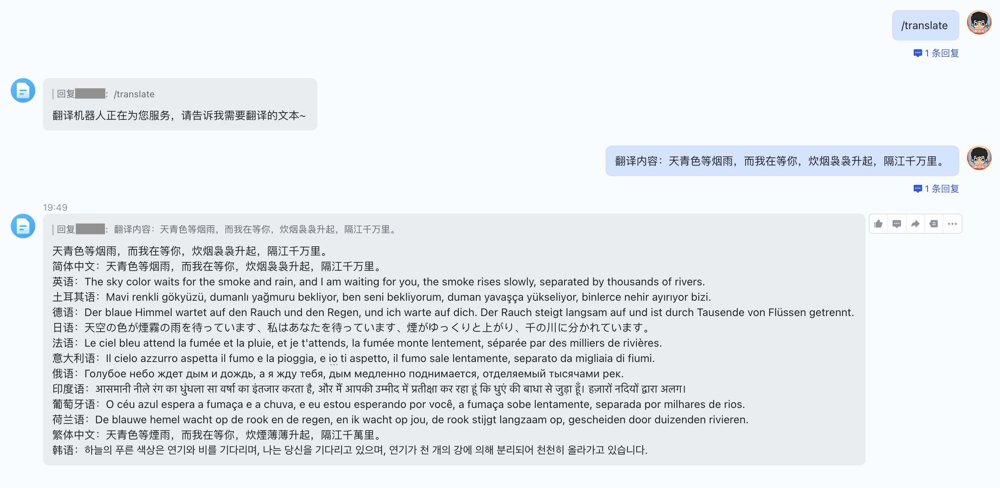

---
### AITranslator
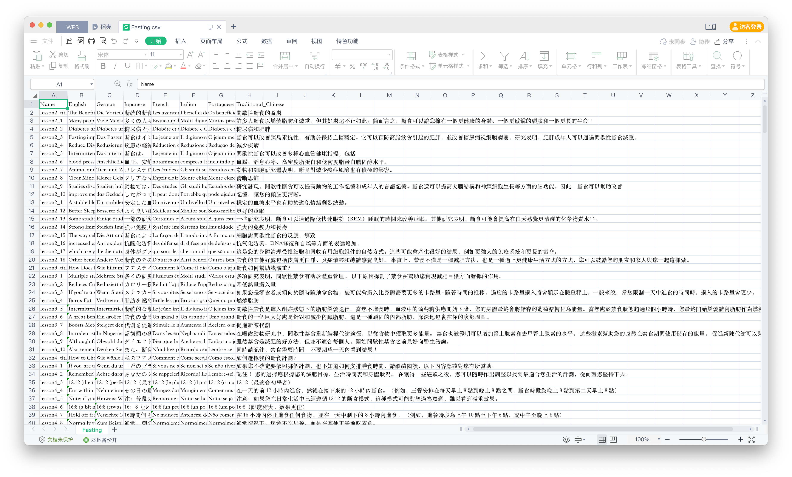

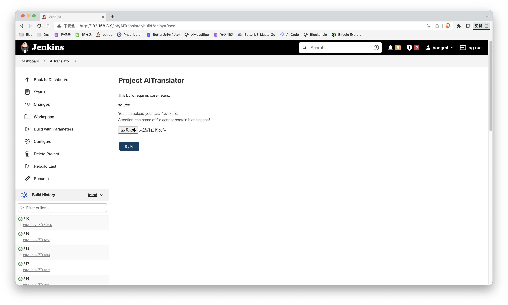

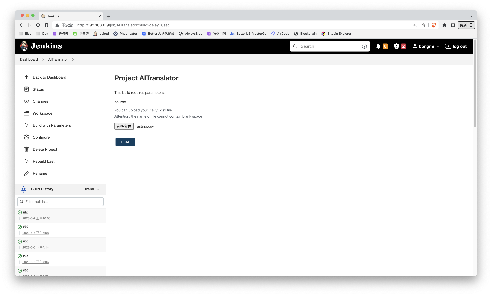

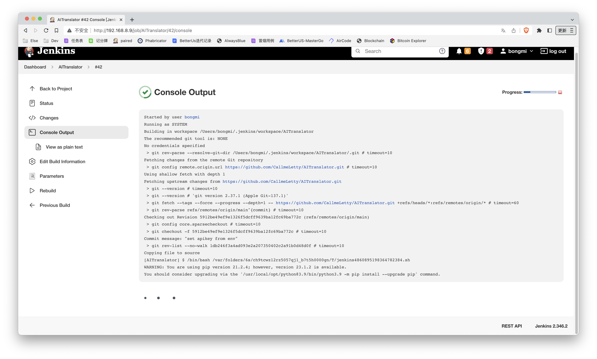

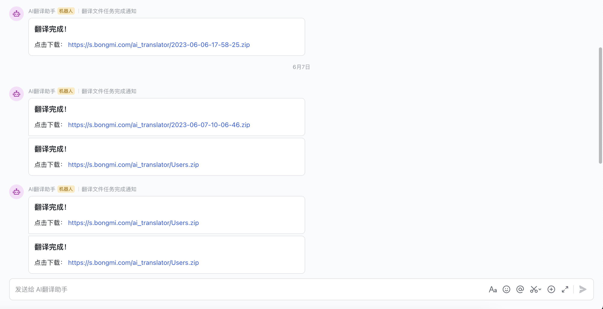

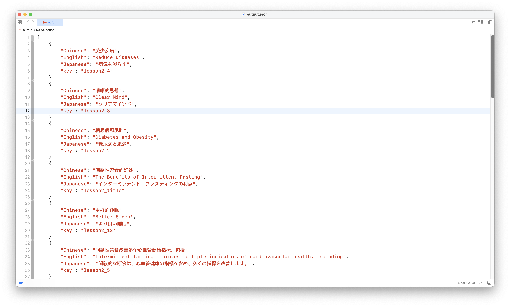

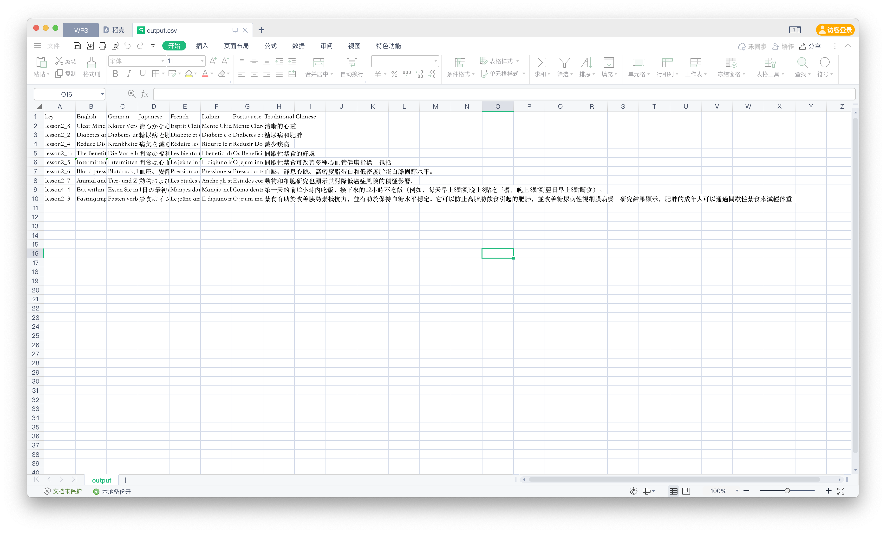