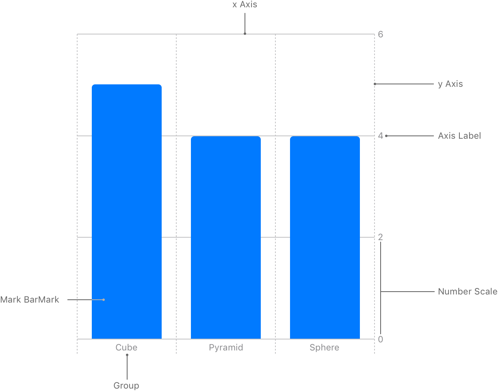
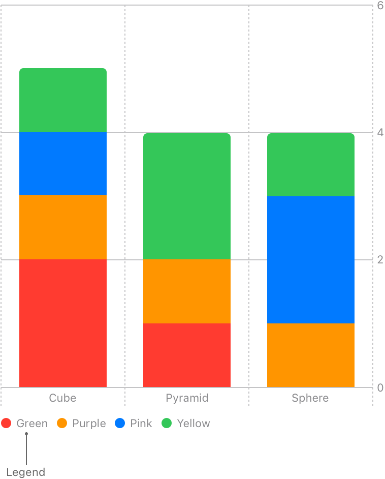
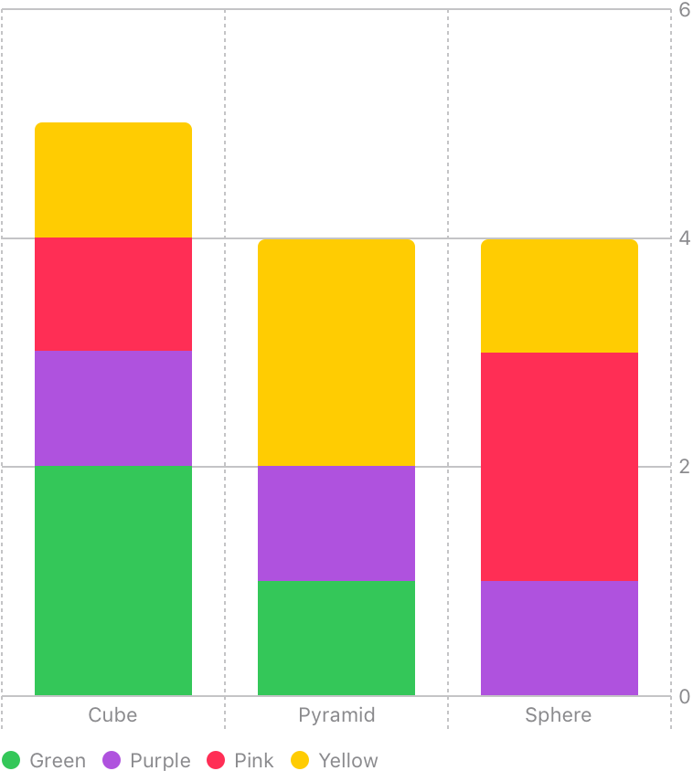
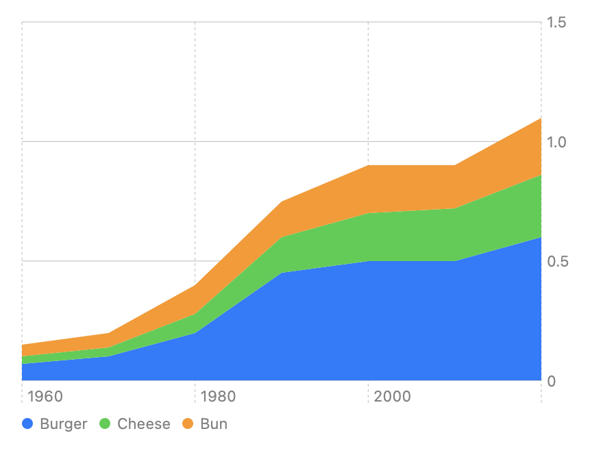
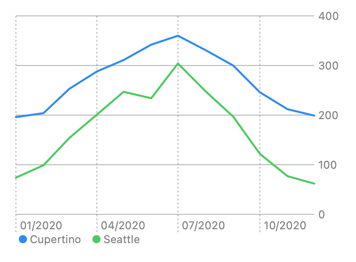
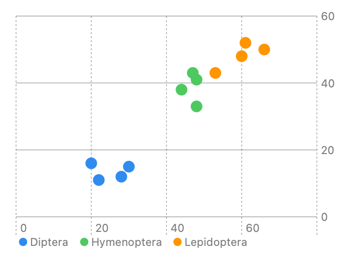
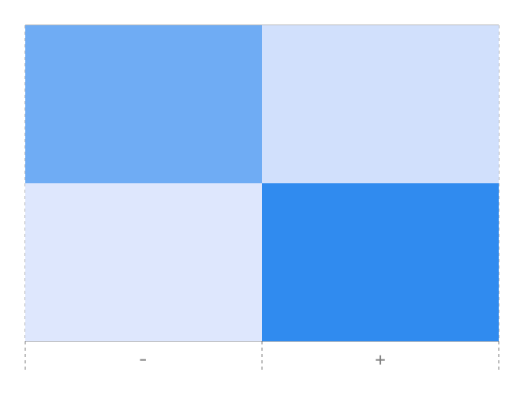
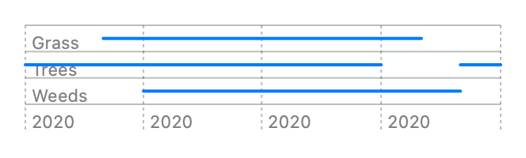
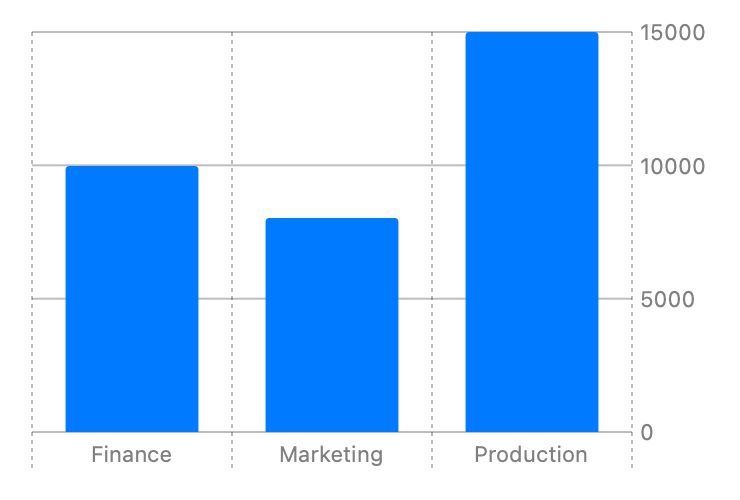

# Swift Charts

iOS 16.0+

### 快速搭建一个图表
1. 确定数据结构

```swift
struct ToyShape: Identifiable {
    var type: String
    var count: Double
    var id = UUID()
}
```

2. 初始化数据

```swift
var data: [ToyShape] = [
    .init(type: "Cube", count: 5),
    .init(type: "Sphere", count: 4),
    .init(type: "Pyramid", count: 4)
]
```

3. 创建Chart（使用BarMark）

```swift
import SwiftUI
import Charts

struct BarChart: View {
    var body: some View {
        Chart {
            ForEach(data) { shape in
                BarMark(
                    x: .value("Shape Type", shape.type),
                    y: .value("Total Count", shape.count)
                )
            }
        }
    }
}
```



4. 使用不同颜色区分

```swift
struct ToyShape: Identifiable {
    var color: String
    var type: String
    var count: Double
    var id = UUID()
}

var stackedBarData: [ToyShape] = [
    .init(color: "Green", type: "Cube", count: 2),
    .init(color: "Green", type: "Sphere", count: 0),
    .init(color: "Green", type: "Pyramid", count: 1),
    .init(color: "Purple", type: "Cube", count: 1),
    .init(color: "Purple", type: "Sphere", count: 1),
    .init(color: "Purple", type: "Pyramid", count: 1),
    .init(color: "Pink", type: "Cube", count: 1),
    .init(color: "Pink", type: "Sphere", count: 2),
    .init(color: "Pink", type: "Pyramid", count: 0),
    .init(color: "Yellow", type: "Cube", count: 1),
    .init(color: "Yellow", type: "Sphere", count: 1),
    .init(color: "Yellow", type: "Pyramid", count: 2)
]

Chart {
    ForEach(stackedBarData) { shape in
        BarMark(
            x: .value("Shape Type", shape.type),
            y: .value("Total Count", shape.count)
        )
        .foregroundStyle(by: .value("Shape Color", shape.color))
    }
}
```



5. 自定义颜色图示含义

```swift
Chart {
    ForEach(stackedBarData) { shape in
        BarMark(
            x: .value("Shape Type", shape.type),
            y: .value("Total Count", shape.count)
        )
        .foregroundStyle(by: .value("Shape Color", shape.count))
    }  
}
.chartForegroundStyleScale([
    "Green": .green, "Purple": .purple, "Pink": .pink, "Yellow": .yellow
])
```



### 图表种类

- AreaMark



- LineMark



- PointMark



- RectangleMark



- RuleMark



- BarMark



### Structure Chart

A SwiftUI view that displays a chart.

To create a chart, instantiate a Chart structure with marks that display the properties of your data. For example, suppose you have an array of ValuePerCategory structures that define data points composed of a category and a value:

```SwiftUI
struct ValuePerCategory {
    var category: String
    var value: Double
}


let data: [ValuePerCategory] = [
    .init(category: "A", value: 5),
    .init(category: "B", value: 9),
    .init(category: "C", value: 7)
]
```

You can use BarMark inside a chart to represent the category property as different bars in the chart and the value property as the y value for each bar:

This chart initializer behaves a lot like a SwiftUI ForEach, creating a mark — in this case, a bar — for each of the values in the data array:

```SwiftUI
Chart(data, id: \.category) { item in
    BarMark(
        x: .value("Category", item.category),
        y: .value("Value", item.value)
    )
}
```

You can compose more sophisticated charts by providing more than one series of marks to the chart. For example, suppose you have profit data for two companies:

```SwiftUI
struct ProfitOverTime {
    var date: Date
    var profit: Double
}


let departmentAProfit: [ProfitOverTime] = <#Profit array A#>
let departmentBProfit: [ProfitOverTime] = <#Profit array B#>
```

The following chart creates two different series of LineMark instances with different colors to represent the data for each company. In effect, it moves the ForEach construct from the chart’s initializer into the body of the chart, enabling you to represent multiple different series:

```SwiftUI
Chart {
    ForEach(departmentAProfit, id: \.date) { item in
        LineMark(
            x: .value("Date", item.date),
            y: .value("Profit A", item.profit),
            series: .value("Company", "A")
        )
        .foregroundStyle(.blue)
    }
    ForEach(departmentBProfit, id: \.date) { item in
        LineMark(
            x: .value("Date", item.date),
            y: .value("Profit B", item.profit),
            series: .value("Company", "B")
        )
        .foregroundStyle(.green)
    }
    RuleMark(
        y: .value("Threshold", 400)
    )
    .foregroundStyle(.red)
}
```

You indicate which series a line mark belongs to by specifying its series input parameter. The above chart also uses a RuleMark to produce a horizontal line segment that displays a constant threshold value across the width of the chart

### Protocol ChartContent

#### Styling marks

- foregroundStyle: Sets the foreground style for the chart content.

- opacity: Sets the opacity for the chart content.

- cornerRadius: Sets the corner radius of the chart content.

- lineStyle: Sets the style for line marks.

- interpolationMethod: Plots line and area marks with the interpolation method that you specify.

#### Positioning marks

- offset(CGSize): Applies an offset that you specify as a size to the chart content.

- offset(x: CGFloat, y: CGFloat): Applies a vertical and horizontal offset to the chart content.

- offset(x: CGFloat, yStart: CGFloat, yEnd: CGFloat): Applies an offset to the chart content.

- offset(xStart: CGFloat, xEnd: CGFloat, y: CGFloat): Applies an offset to the chart content.

- offset(xStart: CGFloat, xEnd: CGFloat, yStart: CGFloat, yEnd: CGFloat): Applies an offset to the chart content.

- alignsMarkStylesWithPlotArea(Bool): Aligns this item’s styles with the chart’s plot area.

#### Setting symbol appearancein

- symbol(S): Sets a plotting symbol type for the chart content.

- symbol(symbol: () -> V): Sets a SwiftUI view to use as the symbol for the chart content.

- symbolSize(CGSize): Sets the plotting symbol size for the chart content.

- symbolSize(CGFloat): Sets the plotting symbol size for the chart content according to a perceived area.

#### Encoding data into mark characteristicsin

- foregroundStyle<D>(by: PlottableValue<D>): Represents data using a foreground style.

- lineStyle<D>(by: PlottableValue<D>): Represents data using line styles.

- position<P>(by: PlottableValue<P>, axis: Axis?, span: MarkDimension): Represents data using position.

- symbol<D>(by: PlottableValue<D>): Represents data using different kinds of symbols.

- symbolSize<D>(by: PlottableValue<D>): Represents data using symbol sizes.

#### Annotating marksin

- annotation<C>(position: AnnotationPosition, alignment: Alignment, spacing: CGFloat?, content: () -> C)

Annotates this mark or collection of marks with a view positioned relative to its bounds.

- annotation<C>(position: AnnotationPosition, alignment: Alignment, spacing: CGFloat?, content: (AnnotationContext) -> C)

Annotates this mark or collection of marks with a view positioned relative to its bounds.

#### Masking and clippingin

- mask<C>(content: () -> C)

Masks chart content using the alpha channel of the specified content.

- clipShape(some Shape, style: FillStyle)

Sets a clip shape for the chart content.